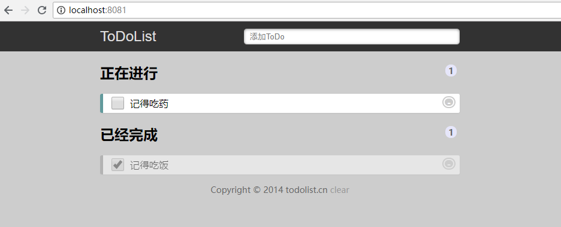
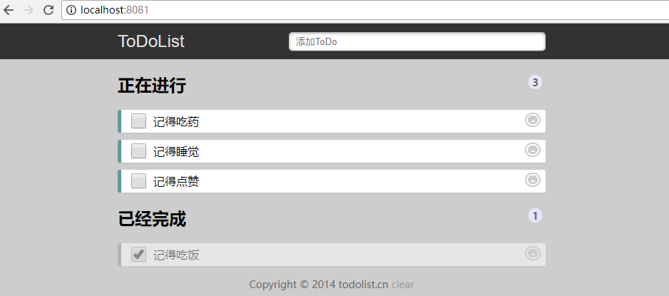

# 和我一起入坑-Vue入门-ToDoList
本项目是仿照这个做滴  [ToDoList](http://www.todolist.cn/) 。使用Vue实现这个代办事项功能。完整的项目在这里[GitHub vue-todolist](https://github.com/yiluyanxia/vue-todolist)。
## （一）基本功

 [Vue官方文档](https://cn.vuejs.org/v2/guide/) 了解一下  
 1. 前置项   
 安装Node，建议使用nvm安装，*逼格比较高（手动滑稽）*
 2.  然后全局安装 [Vue CLI](https://cli.vuejs.org/zh/guide/installation.html)  
 *居然还改名了*
 ```
 npm install -g @vue/cli
 ```
 3. 创建项目
 ```
 vue create vue-todolist
 ```
 4. 启动CLI服务
 ```
 cd vue-todolist
 $ npm run serve
 ```
 5. 目录结构
根据自己的习惯创建文件,并删除多余的代码。我是如下创建的：
```
├── public                                            
├── src                                         
│   ├── assets                             
│   │   └── css                              
│   │       └── styles.css                                          
│   ├── utils
│   │   └── utils.js
│   ├── views
│   │   └── Home.vue                               
│   ├── App.vue
│   ├── main.js
│   ├── router.js
``` 
## (二) Html和CSS部分

打开控制台将样式文件复制粘贴到styles.css文件中。在main.js中导入样式
```js
// main.js
import '@/assets/css/styles.css'
```
将html复制粘贴到Home.vue中的template中

```html
<!-- Home.vue -->
<template>
  <div>
    <header>
      <section>
        <label for="title">ToDoList</label>
        <input type="text" placeholder="添加ToDo"/>
      </section>
    </header>
    <section>
      <h2>正在进行
        <span>1</span>
      </h2>
      <ol class="demo-box">
        <li>
          <input type="checkbox">
          <p>记得吃药</p>
          <a>-</a>
        </li>
      </ol>
      <h2>已经完成
        <span>1</span>
      </h2>
      <ul>
        <li draggable="true">
          <input type="checkbox"checked="checked">
          <p>记得吃饭</p>
          <a>-</a>
        </li>
      </ul>
    </section>
    <footer>
      Copyright &copy; 2014 todolist.cn
      <a>clear</a>
    </footer>
  </div>
</template>
```
  复制完成后，页面长这样  
   
## （三）实现ToDoList的功能
### 添加代办事项
使用v-model 指令在input框上创建双向数据绑定。并为按键添加修饰符，监听键盘enter键。
```html
<input type="text" v-model="todo"  @keyup.enter="addTodo" placeholder="添加ToDo" />
```

```js
data () {
  return {
    todo: '',
    todoList: [],
    todoLen: 0
  }
},
methods: (
  addTodo () {
    let todoObj = {
      todo: this.todo,
      done: false
    }
    this.todoList.push(todoObj)
    this.todoLen++
    this.todo = ''
  },
)
```
### 循环添加的事项
使用v-for将所添加的事项循环显示，并使用v-if条件渲染只显示的内容。
```html
<li v-for="(item, index) in todoList" :key="index" v-if="item.done === false">
  <input type="checkbox">
  <p>{{item.todo}}</p>
  <a>-</a>
</li>
```
这个时候就可以看到添加的内容了  
 

### 切换完成状态以及删除功能
绑定切换状态、删除的事件
```html
<h2>正在进行
  <span>{{todoLen}}</span>
</h2>
<ol class="demo-box">
  <li v-for="(item, index) in todoList" :key="index" v-if="item.done === false">
    <input type="checkbox" @change="changeTodo(index,true)">
    <p>{{item.todo}}</p>
    <a @click="deleteTodo(index,true)">-</a>
  </li>
</ol>
<h2>已经完成
  <span>{{todoList.length - todoLen}}</span>
</h2>
<ul>
  <li v-for="(item, index) in todoList" :key="index" v-if="item.done === true">
    <input type="checkbox" @change="changeTodo(index,false)" checked='checked'>
    <p>{{item.todo}}</p>
    <a @click="deleteTodo(index,false)">-</a>
  </li>
</ul>
```
根据done的值来控制是否显示，在点击事件中对done取反。对未完成的事项长度进行加减。
```js
changeTodo (index, done) {
  if (done) {
    this.todoLen--
    this.todoList[index].done = true
  } else {
    this.todoLen++
    this.todoList[index].done = false
  }
},
deleteTodo (index, done) {
  if(done){
    this.todoLen--
  }
  this.todoList.splice(index, 1)
},
```
到此为止，这个功能就算完成了，但是当我们刷新页面后数据就不见了，这里我们需要用到localStorage。
### localStorage的使用
todoList数组的每一次增加和删减都会用到localStorage，将localStorage封装起来方便使用。
```js
// utils.js
export function setItem (key, value) {
  localStorage.setItem(key, JSON.stringify(value))
}
export function getItem (key) {
  return JSON.parse(localStorage.getItem(key))
}
export function removeItem (key) {
  localStorage.removeItem(key)
}
```
导入utils
```js
import * as Utils from '@/utils/utils'
```
在数组的每一次改变都需要使用Utils.setItem进行数据的存储。在addTodo方法中，一定要对Utils.getItem返回的数据进行判断，否则会报“Cannot read property 'push' of null”
```js
addTodo () {
  let todoObj = {
    todo: this.todo,
    done: false
  }
  var tempList = Utils.getItem('todoList')
  if (tempList) {
    tempList.push(todoObj)
    Utils.setItem('todoList', tempList)
  } else {
    var tempData = []
    tempData.push(todoObj)
    Utils.setItem('todoList', tempData)
  }
  this.todoList.push(todoObj)
  this.todoLen++
  this.todo = ''
},
deleteTodo (index, done) {
  if(done){
    this.todoLen--
  }
  this.todoList.splice(index, 1)
  Utils.setItem('todoList', this.todoList)
  
},
changeTodo (index, done) {
  if (done) {
    this.todoLen--
    this.todoList[index].done = true
    Utils.setItem('todoList', this.todoList)
  } else {
    this.todoLen++
    this.todoList[index].done = false
    Utils.setItem('todoList', this.todoList)
  }
},
```
### 初始事件
在初始的时候对未完成事项进行自加运输，以得到初始的长度。
```js
methods： {
  initTodo () {
    var todoArr = Utils.getItem('todoList')
    if (todoArr) {
      for (let i = 0, len = todoArr.length; i < len; i++) {
        if (todoArr[i].done === false) {
          this.todoLen++
        }
      }
      this.todoList = todoArr
    }
  },
}
mounted () {
  this.initTodo()
}
```
### 还有页脚的clear按钮
```html
<footer>Copyright &copy; 2014 todolist.cn<a @click="clearData()">clear</a></footer>
```
```js
clearData () {
  localStorage.clear()
  this.todoList = []
  this.todoLen = 0
}
```
### 说在后面的话
完整的项目在这里[GitHub vue-todolist](https://github.com/yiluyanxia/vue-todolist)。 

*实际上，关于这个ToDoList我写了三个小demo，分别是*  
[Angular ToDoList](https://segmentfault.com/a/1190000013519099)的小博文，完整的项目在这里[GitHub ng-first](https://github.com/yiluyanxia/ng-first)。  
[React Native ToDoList](https://segmentfault.com/a/1190000015933522)的小博文，完整的项目在这里[GitHub AwesomeProject](https://github.com/yiluyanxia/AwesomeProject)。  
[Vue ToDoList](https://segmentfault.com/a/1190000015986287)的小博文，完整的项目在这里[GitHub vue-todolist](https://github.com/yiluyanxia/vue-todolist)。

*为什么写了三个呢？*  
因为我闲啊！！ 

*为什么都是写这种超级简单的小demo?*   
因为复杂的我不会!

*说实话，你到底想干嘛？*  
本来我是想对三个框架进行对比，结果发现技术不佳，学艺不深，无法对其进行比对。所以结论是喜欢哪个就用哪个好了 *（这样不好，不要学我）* 。

*自问自答是不是很尴尬？*  
是的。
